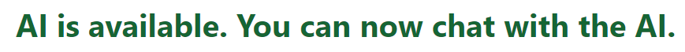

# Chrome Gemini AI

[](https://www.youtube.com/watch?v=qhKf214KGA0)]

[](https://img.shields.io/github/last-commit/covicale/chrome-gemini-ai)
[](https://img.shields.io/github/issues-raw/covicale/chrome-gemini-ai)
[](https://img.shields.io/github/issues-pr/covicale/chrome-gemini-ai)
[](https://img.shields.io/github/license/covicale/chrome-gemini-ai)

Chrome Gemini AI is a very simple project made with Next.JS in order to experiment with the new features of the Chrome browser with the Gemini AI model.

The project allows the user to chat with the Gemini AI model and tweak the model's parameters to see how it affects the model's responses.

A demo of the project can be found [here](https://chrome-gemini-ai.vercel.app/).

# Table of Contents

- [Chrome Gemini AI](#chrome-gemini-ai)
- [Table of Contents](#table-of-contents)
- [Requirements](#requirements)
- [Deploy](#deploy)
- [References](#references)

# Requirements

To be able to run the project, you need to have the following things:

- **Canary Chrome Browser** _(version 127 or higher)_
- **Activate - Prompt API for Gemini Nano**: Set the flag in **ENABLED** - _chrome://flags/#prompt-api-for-gemini-nano_
- **Activate - Optimization Guide On Device Model**: Set the flag in **Enabled BypassPerfRequirement** - _chrome://flags/#optimization-guide-on-device-model_
- **Download the model**: Download the model in _chrome://components_ and search for **Optimization Guide On Device Model**

After you have all the requirements, you can run the project and it should appear something like this:



Otherwise, if you don't have the requirements, it should appear something like this:


# Deploy

To deploy the project, you need to have the following things:

- **Node.js** _(version 14 or higher)_
- **Next.js** _(version 14 or higher)_

After you have all the requirements, you can run the following commands:

```bash
# Clone the repository
$ git clone https://github.com/Covicale/chrome-gemini-ai.git

# Go to the project directory and install the dependencies
$ cd chrome-gemini-ai
$ npm install

# Run the project
$ npm run dev
```

# References

- [Next.js](https://nextjs.org/)
- [Google's AI API](https://github.com/explainers-by-googlers/prompt-api)
